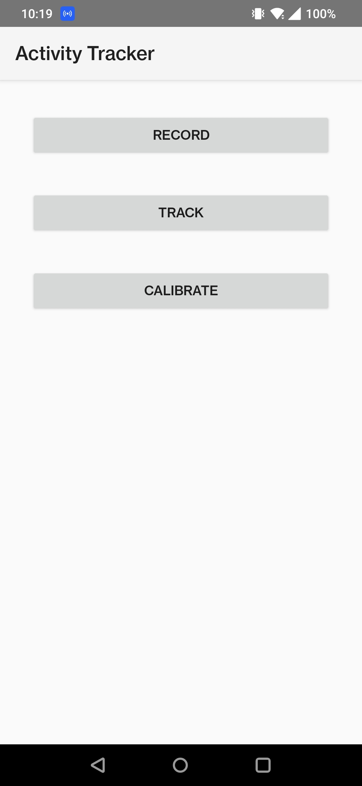
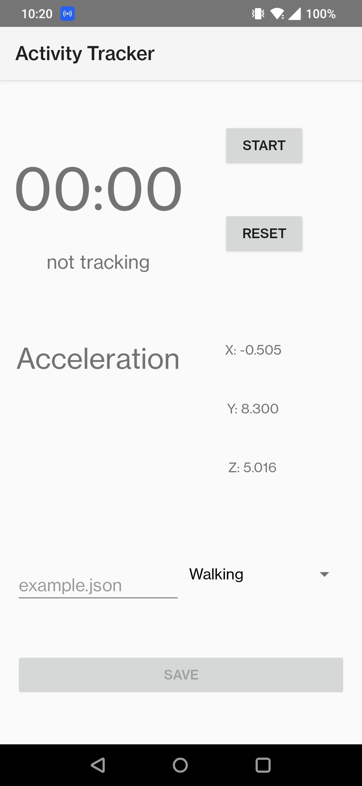
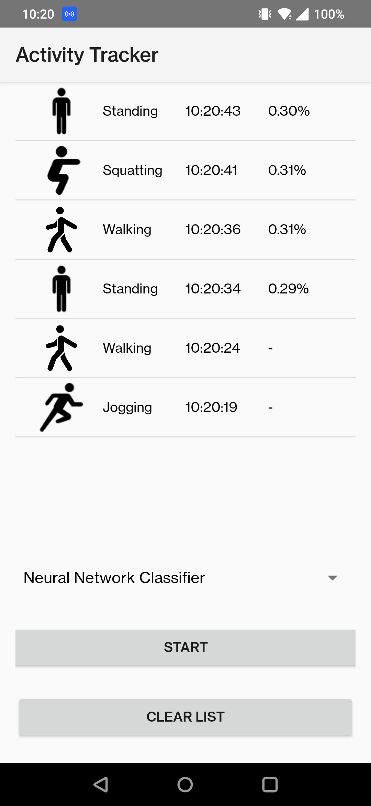
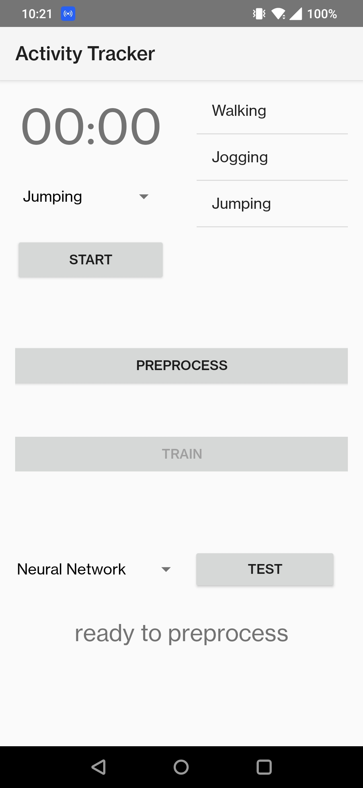

# Activity Tracker App for Mobile Devices

This repository contains the code for an activity tracker app developed as part of a mobile computing project. The app uses sensor data from a smartphone to recognize and predict various activities such as walking, jogging, jumping, squatting, sitting, and standing. It employs machine learning models, including k-Nearest Neighbors (kNN) and neural networks, for activity recognition.

## Key Features

- Sensor Data Processing: Utilizes accelerometer data from the smartphone to detect user activities.
- Machine Learning Models: Implements both classical kNN and neural network models using TensorFlow, with options for feature-based and raw signal-based approaches.
- Transfer Learning: Adapts the base model to new data recorded from different positions (e.g., front vs. back pocket) directly on the smartphone.
- User Interface: Provides a simple UI with functionalities for data recording, activity tracking, and model calibration.
- Performance: Achieves up to 90% accuracy for activity recognition in testing scenarios and around 70% for transfer learning cases.

## App UI Overview

The app interface includes a Menu and three main activities:

- Record: Captures data for 20 seconds with a timer. Recorded data can be saved in JSON format for later processing.
- Track: Allows activity detection using various models (kNN, feature neural network, raw neural network, transfer learning). Displays detected activity, time, and prediction confidence.
- Calibrate: Facilitates data recording, preprocessing, and model training for transfer learning. Users can test both the base and transfer learning models.

Navigate through the Menu to access these features and utilize the app for data recording, activity tracking, and model calibration.

  
  
  
  

